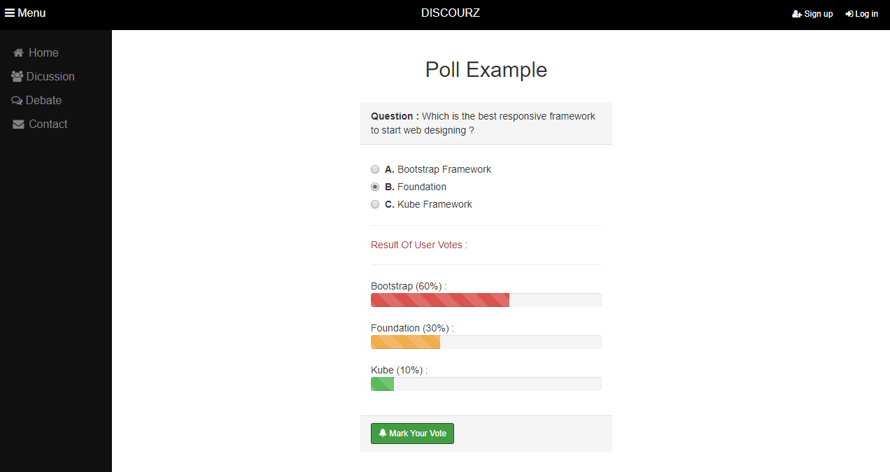

# TEAM NAME

* 404 Name Not Found

# WEB APPLICATION NAME

* Discourz

# Team Overview

* Patrick Conway, pjconway
* Dhruv Khurana, khuranadhruv18
* Panupong Leenawarat, Okrymus inc,
* Jared Pina, J4yrad
* Prakrit Saetang, Number535
* Chen Xie, chen678

# Innovative Idea

We want to build a debate website to let all the students to freely discuss hit and hot om campus. There are not that individual platfom at UMass to allow students to share opinions and poll topics. The idea is similar to existing debating websites such as debate.org, however, we would like to make our website innovative by only providing a live debate/discussion which we hope it will encorage people to actively engage to a debate more. Also each user will be able to check his/her statistics of all debates a user has participated such as how many votes he/she received.

# Important Data

* The topics under discussion, numbers of discussion and polls
* The debate topics and people's words
* The topics and the number of polls
* The user profiles, including user name, password, picture, "about me", address, and the topics they participated, votes they received

# User Interface

Provide a description and images of the user interface your
application will intend on supporting.

The above image is a screenshot of our application's home page. On the left, you can see the drop down menu which directs you to different parts of our application. In the center, you can see areas where you can start multiple discussions, debates, or polls. The top right corner contains buttons that will allow you to sign up or log in.

The above image is a screenshot of the page where you can edit your Discourz profile. This page allows you to upload a photo of yourself, which will be visible to other users. There are text boxes for first name, last name and a short description of yourself. Below that, you can enter your city and use simple drop down menus to select the state and country you live in.

The above image is a screenshot of the page where you can take polls with an example poll question. The question appears on the top and below it are several options for you to choose in the poll with a button next to them. Below the options are bars with percentages showing what the results of the poll are at that moment in time.

The above image is a screenshot of the discussion page of our application with an example discussion in the chat box. This allows you to have a discussion about a certain topic with multiple people in one chat box. On the right side of the page, you can see all the people currently in this discussion (up to 12 including yourself). The different colored messages allow you to distinguish who is talking with ease, and the text box on the bottom allows you to type your own message. There is also a search bar in the upper right that allows the user to search for people to potentially add to the disucssion.

The above image is a screenshot of the debate page of our application with an example debate in the chat box. This page looks very similar to the discussion page, except for the fact that you can only talk to one person at a time. As in the discussion page, the colors of the messages are different colors for different people talking. There is also a text box at the bottom of the page for sending your message to the person you are debating.
